# Ensuring Quality Releases

## Azure DevOps Pipeline

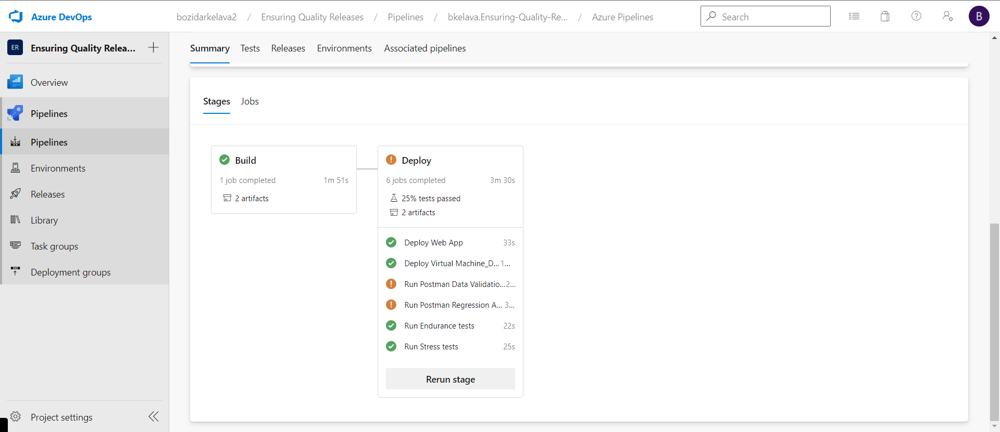

## Terraform output

### Terraform install

### Terraform init

### Terraform apply

## JMeter

### JMeter endurance performance testing

JMeter endurance test generated report is available [here](report_example/endurance_test_report.pdf)

### JMeter stress performance testing

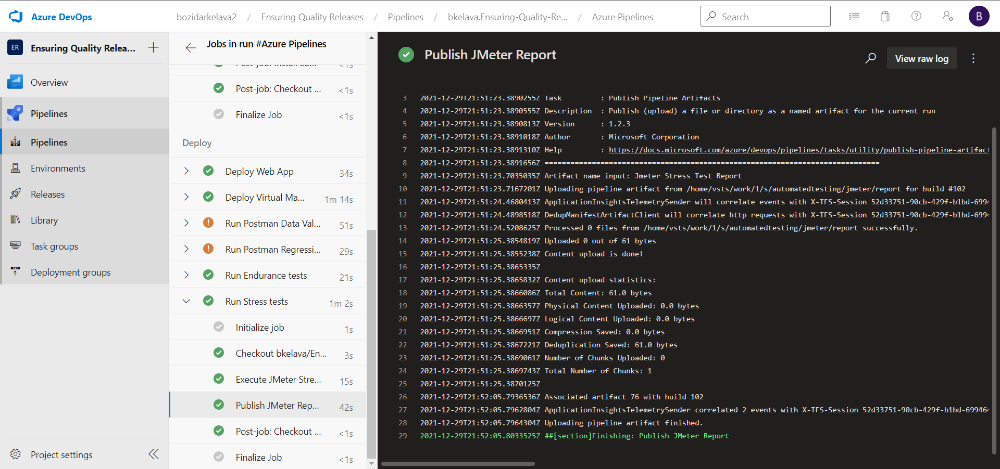

JMeter stress test generated report is available [here](report_example/stress_test_report.pdf)

## Selenium

## Postman

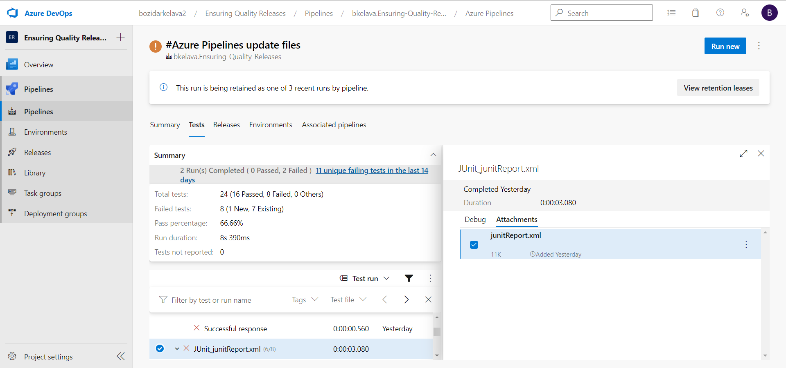

Sample report is available [here](report_example/junitReport.xml), preview is available [here](report_example/index.html). Preview is made using [xunit-viewer](https://github.com/lukejpreston/xunit-viewer).

### Postman regression API test

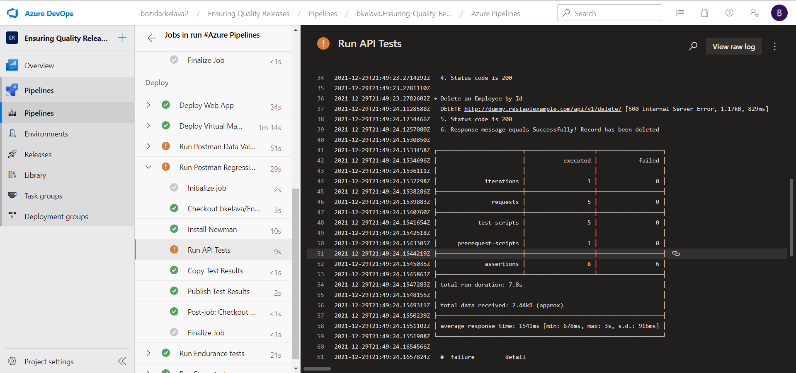
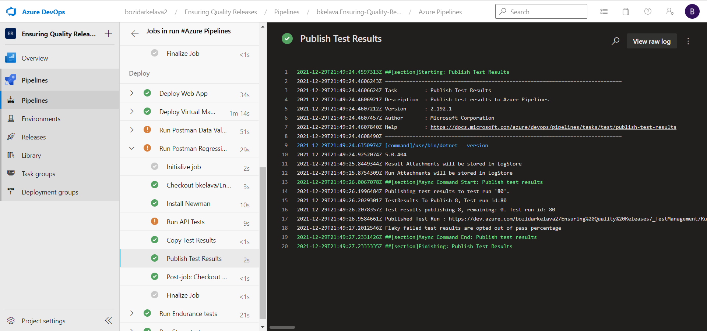

### Postman data validation API test

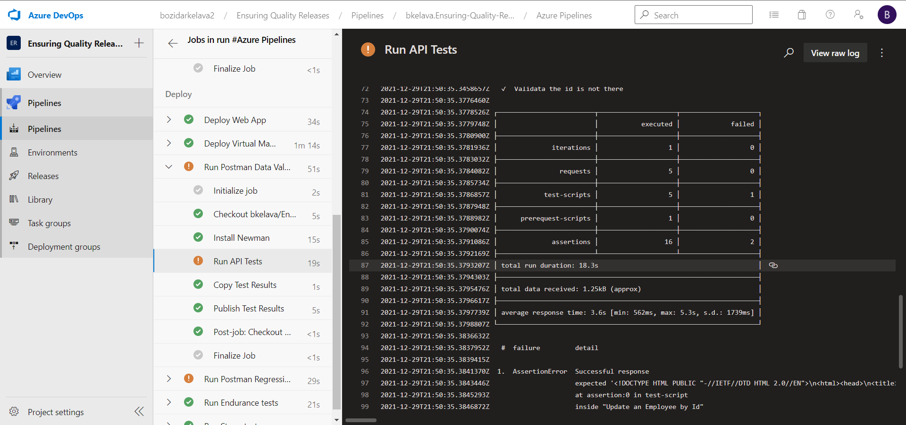

## Azure Devops Test reports

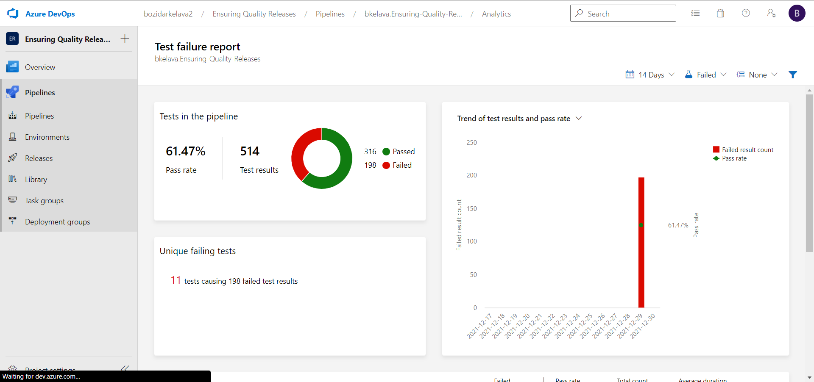
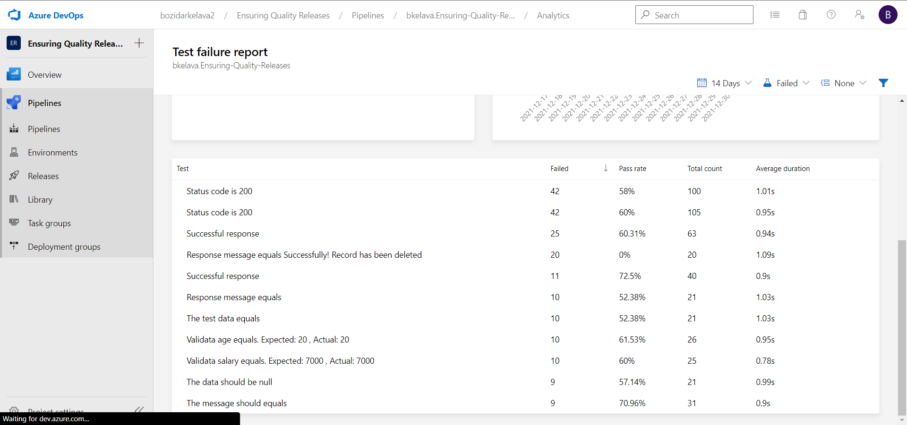

## E-mail alert and logs

Setting up alert rule
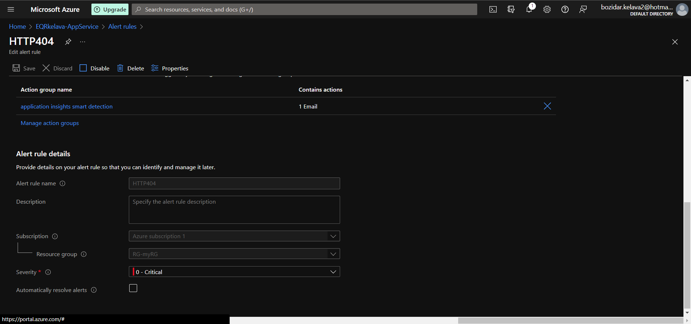
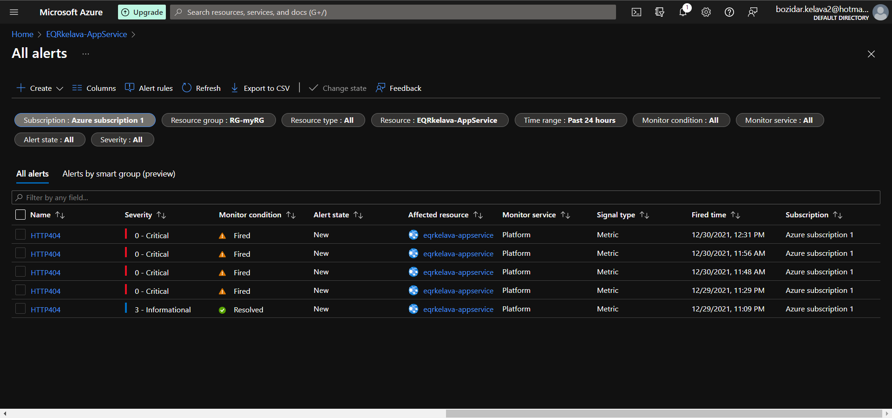
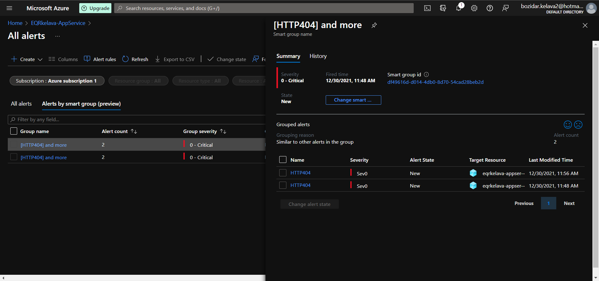

E-mail upon alert
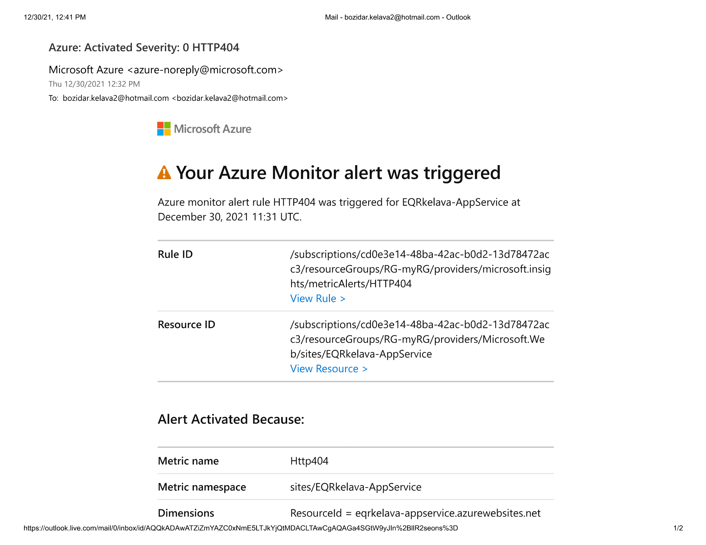
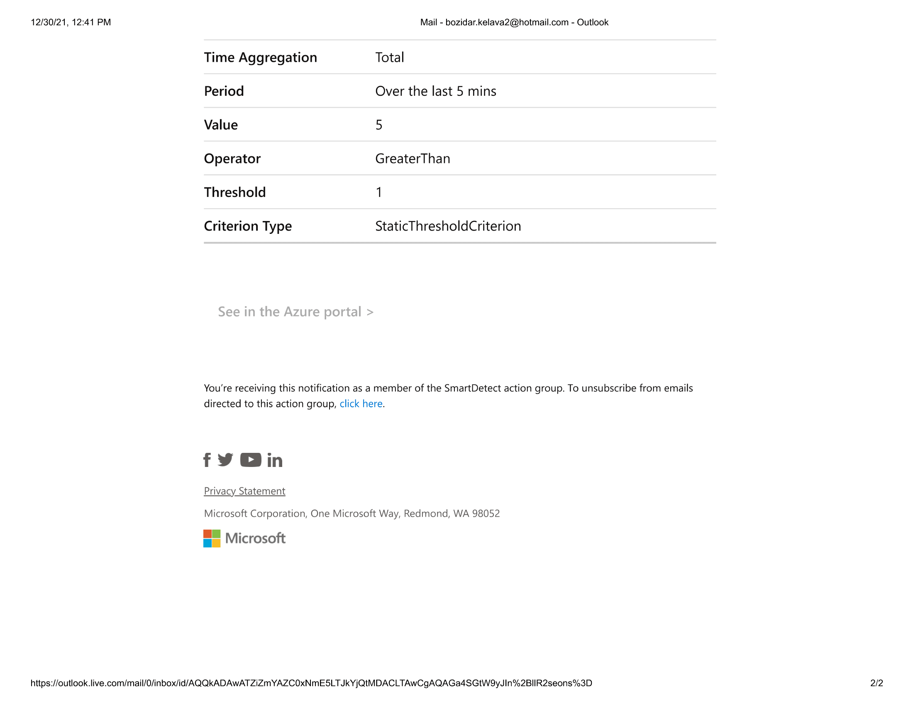

E-mail to Azure portal
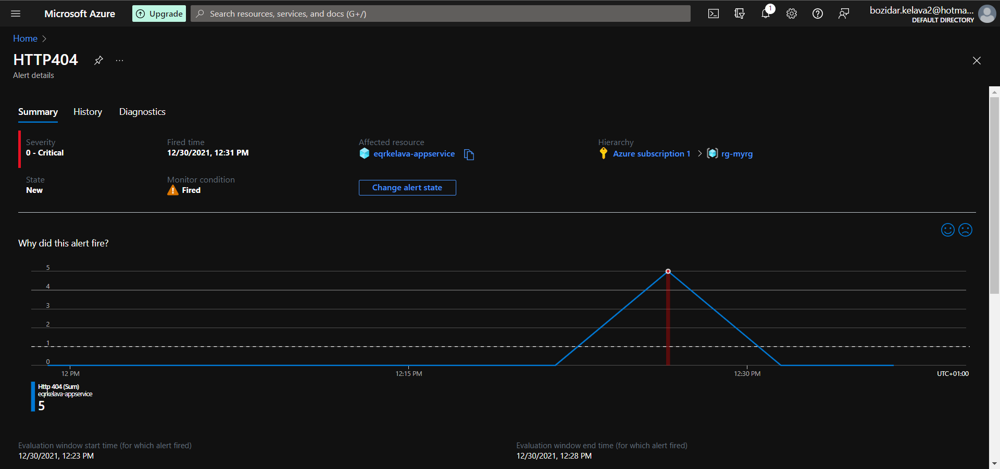
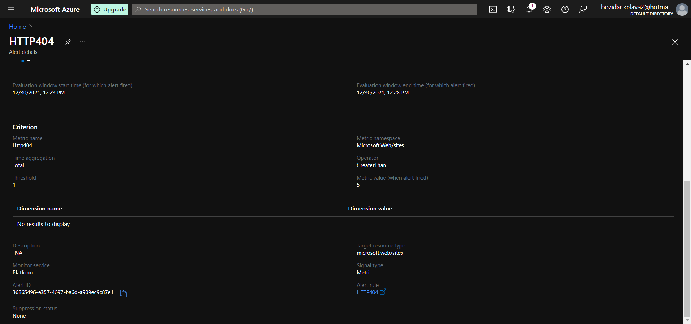

App Service statistics
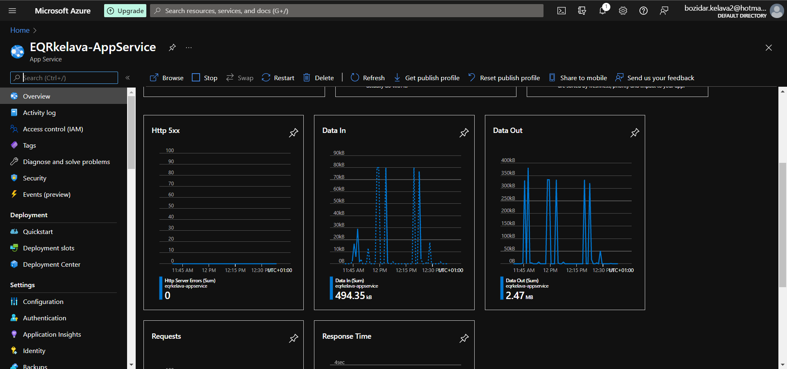
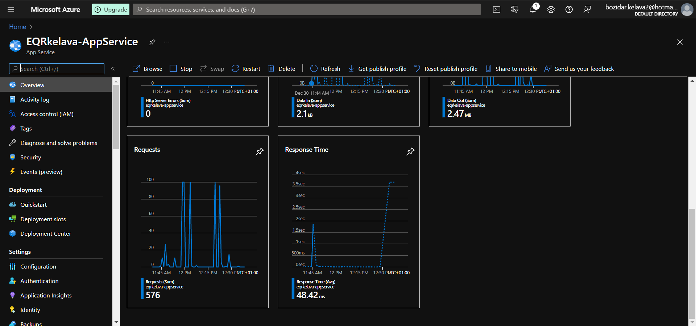

Logs - no logs from your command line!
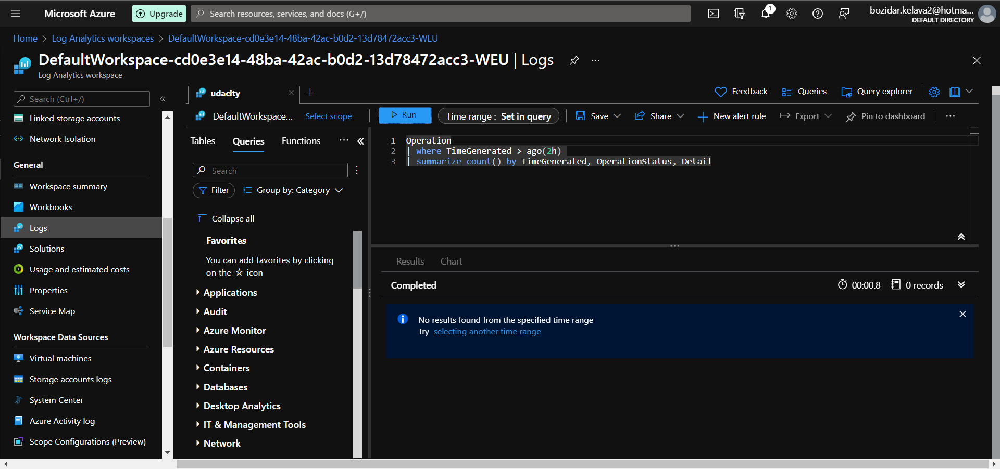
