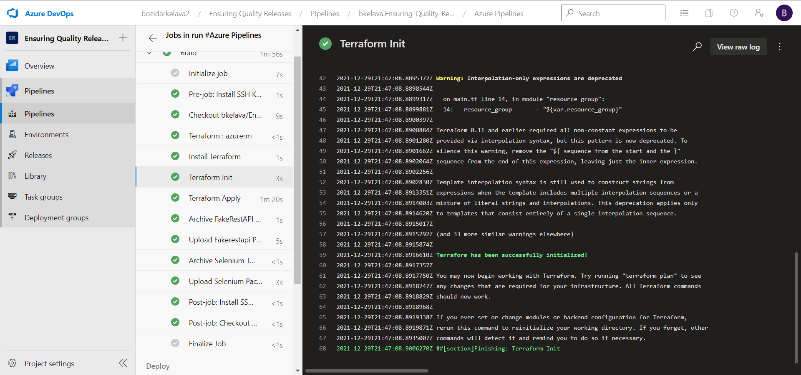
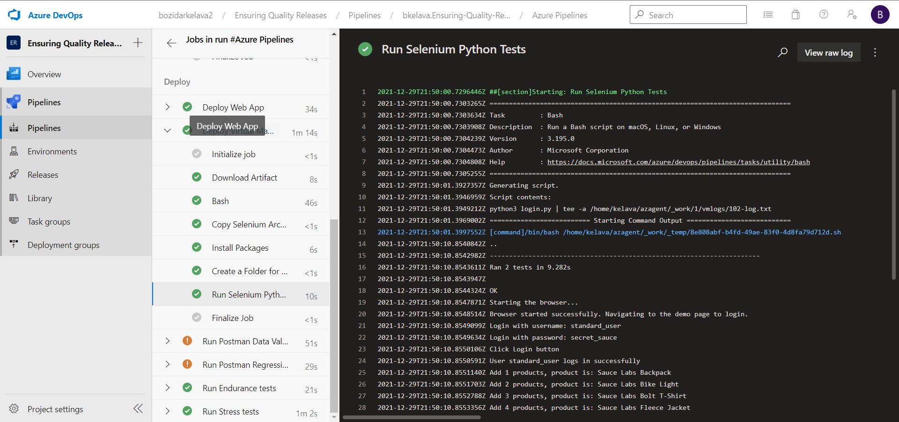

# Ensuring Quality Releases

## Terraform output

### Terraform install

### Terraform init

### Terraform apply

## JMeter

### JMeter endurance performance testing

### JMeter stress performance testing

## Selenium

## Postman

