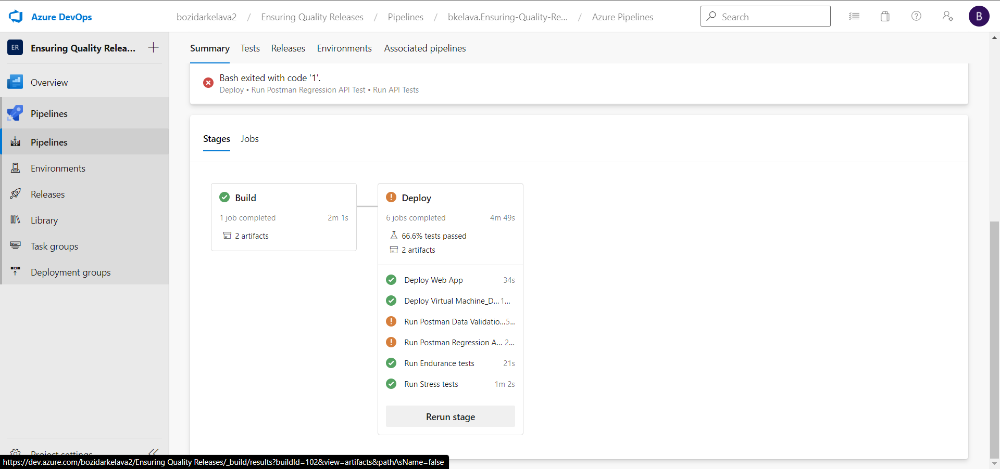
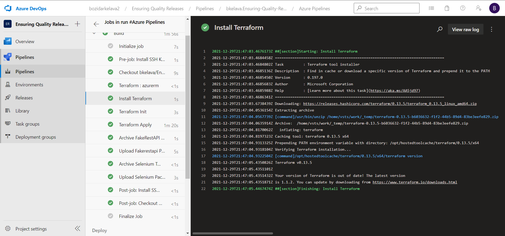
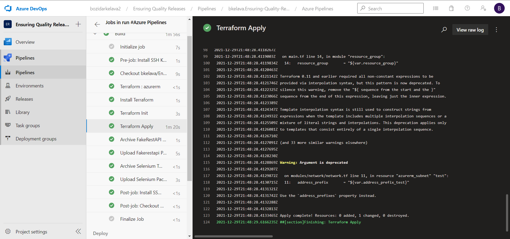
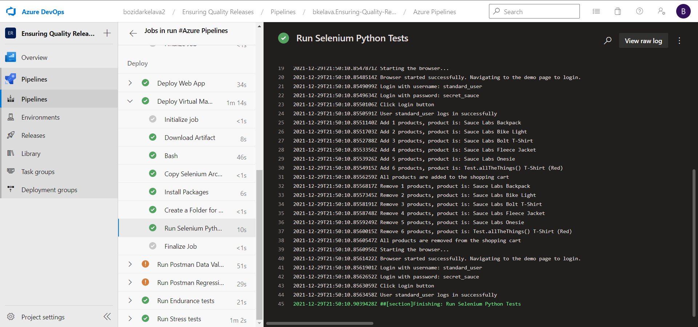
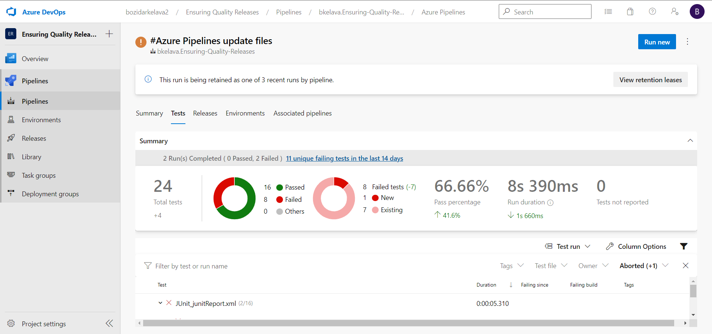

# Ensuring Quality Releases

## Azure DevOps Pipeline

## Terraform output

### Terraform install

### Terraform init

### Terraform apply

## JMeter

### JMeter endurance performance testing

### JMeter stress performance testing

## Selenium

## Postman

Sample report is available [here](report_example/junitReport.xml), preview is available [here](report_example/index.html). Preview is made using [xunit-viewer](https://github.com/lukejpreston/xunit-viewer).

### Postman regression API test

### Postman data validation API test

